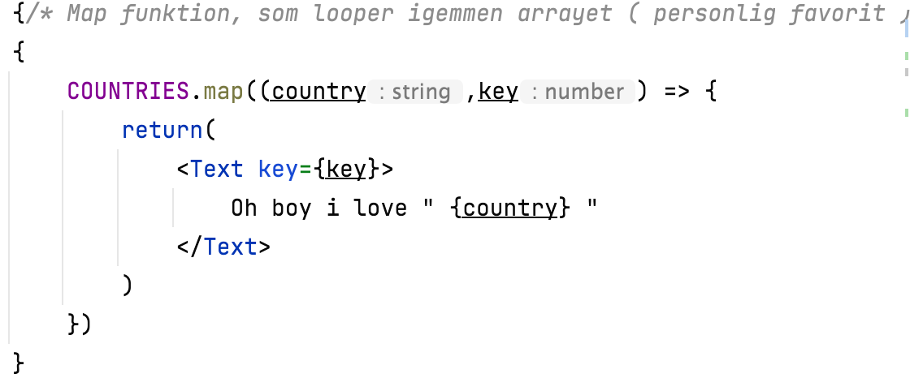
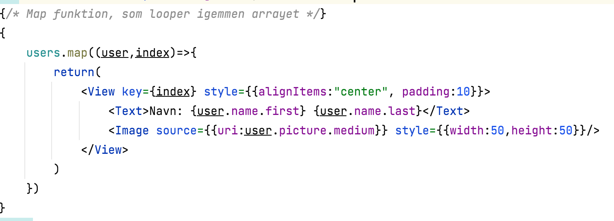

# 3_lister_vejledning

## Slutresultat
https://user-images.githubusercontent.com/48329669/128570069-64627288-c9fa-4313-aa17-d727d279563e.mp4

## App.js
1. Opret et nyt expo projekt med `` expo init <projektNavn>`` i din mappe med opgaver

## components
1. Opret en ny mappe kaldt ``components `` som skal indeholde 3 filer kaldt ArrayListComponent.js, FetchListComponent.js og FlatListComponent.js.
2. I hver af filerne brug skabelonen fra hints
   1. Husk også at KomponentNavn skal være ens med filnavnet
   2. Husk at importere React
   3. Husk at importere Text fra react-native

## App.js
1. Opret først et View som wrapper applikationen i return
2. Tilføj i View'ets attributter en styling med container `` style={styles.container} ``
3. Opret et nyt stylesheet kaldt med skabelon 2, og eventuelt ændre baggrundsfarven
4. import nu de tre nyoprettet komponenter med hver deres komponentnavn som fx ``<ArrayListComponent/>``
5. Nu burde du have 3 tekster fra hver af de nyoprettet komponenter

## const.js
1. opret en såkaldt const.js i mappens rod, som skal bruges til indeholde alt vores "hardcoded data", som i dette tilfælde kommer til at være vores lande, biler og vores fetch url
2. opret nu hhv en const for CARS, COUNTRIES og GET_USERS_URL med dataen nede fra skabelon 3. Husk for at vi kan "bruge" vores data, så skal const'en blive eksporteret. Så hvis der skulle eksporteres en liste af OL-lege skal man skrive ``export const OL_LEGE = ['volleyball','basketball','spydkast']  ``
3. For at teste dine lister og url kan du eventuel console.log() dem i App.js, for at se om const'ene kan kaldes på ( husk at importere const og funktionerne i toppen af App.js)

## ArrayListComponent.js
1. I return funktionen opret et `<View> </View>` som wrapper så der agerer som "forældren" til komponenterne herunder. For der kan kun være en "forældre" i return funktionen
2. Tilføj nu en styling til ``View`` elementet ligesom fra App.js, men her vil vi gerne have der bliver tilføjet alignItems: 'center', justifyContent: 'center' i containeren
3. Style nu ligeledes det nuværende `<Tekst> </Text>` element så det ligner en overskrift ( se evt referencer om styling)
4. Opret under Tekst elementet et `<ScrollView></ScrollView>` element ( læs mere på https://reactnative.dev/docs/scrollview )
5. Definer i ScrollViewet at den maks må mere 80 i højden med `` style={{height:80}}``
6. Tilføj nu følgende kodestykke: 
   1. Det vi gør her er at loope igennem vores lande med en map funktion, som looper igennem arrays. Heri laver vi en funktion som først har værdien og dernæst index nummeret. Der bruger vi keyen til at definere pladsen på elementet og country til udprint af vores værdi
7. Tjek nu om der er en række lande udprintet på din telefon

## FlatListComponent.js 
1. I return funktionen opret et `<View> </View>` som wrapper så der agerer som "forældren" til komponenterne herunder. For der kan kun være en "forældre" i return funktionen
2. Tilføj nu en styling til ``View`` elementet ligesom fra App.js, men her vil vi gerne have der bliver tilføjet alignItems: 'center', justifyContent: 'center' i containeren
3. Style nu ligeledes det nuværende `<Text> </Text>` element så det ligner en overskrift ( se evt referencer om styling)
4. Tilføj nu en `<FlatList />` med attributterne style, data, renderItem og keyExtractor.
   1. I style skal der være et objekt med height:80
   2. I data, skal vi have vores CARS fra const.js
   3. I renderItem skal vi have en funktion med props for Item som returnere en CarItem med attributterne item, som har en item og en attribut msg med selvvalgt tekst ( se hint 4)
   4. Skriv følgende i `keyExtractoren={item => item}`
5. Opret nu en funktion kaldt CarItem som har i parametrene () ``{item,msg}``
   1. I funktionen lav en et return, som returnere et ``<Text> </Text>`` som har hhv ``{msg}`` og `` {item} `` i sig
6. Se nu i App.js om du har en liste af biler 
   1. Hvis du oplever problemer så husk at bruge console.log()

## FetchListComponent.js - useState og useEffect
1. opret nu 3 states kaldt users, msg og amount. Disse states skal håndtere de data vi henter fra vores endpoint i vores const.js
   1. Tip: ``const [navn,setNavn] = useState({});``
   2. Husk at sætte en initial state på hver af statesene
2. Opret nu en useEffect, som kalder en funktion ved navn loadUsers(), og lav en dependency af amount
   1. Hint 5
3. Lav en async funktion kaldt loadUsers 
   1. `` const loadUsers = async () => {}``
   2. Deri lav en `try{} catch(error){}`hvor du først laver en fetch med GET_USERS_URL fra const.js. Dette fetch sættes ligmed en const response. 
   3. derunder lav en const json = await response.json();
   4. Til sidst setUsers(json.result)
      1. Se evt hint 6
   5. Derefter lav en setMsg med error i catch'en
4. Gå nu ned i return funktionen og "wrap" tekst elementen med en if else shorthand, hvor i if'et skal der stå users.length > 0
   1. Se evt hint 7
5. I if statementet lav samme struktur med View og overskrift tekst som de andre komponenter
   1. Under `<Text> </Text>` elementet opret et `<TextInput/>` element som har tilhørende attributter: style, onChangeText, value, placeholder og keyboardType
   2. Stylen på feltet kan være `` {borderWidth:1,borderColor:"black",width:"70%",padding:4} ``
   3. onChangeText skal sættes med setAmount
   4. value skal være amount.toString()
   5. placeholder kan du selv bestemme, men skal være en string
   6. keyboardType skal være numeric
   7. Se eventuelt textinput i referencer
6. Opret under TextInputtet et `<ScrollView> </ScrollView>` med følgende attributter: ` bounces={true} style={{height:350,width:"60%"}} `
   1. Herunder lav en map funktion som looper igennem users. se Screenshot
   2. 
7. Under ScrollViewet tilføj følgende: <Text>{msg ? msg :""}</Text>
8. Tjek nu på din telefon om du kan skrive et antal og at viste brugere vil skifte
   1. Hvis du oplever problemer så HUSK console.log igennem dine objekter eller states + læs hvad react native brokker sig over.


## Hints

### skabelon 1
``` 
const KomponentNavn = (props) => { 
    return (
        <Text>Det er mit KomponentNavn</Text>
    )
}

export default KomponentNavn; 
```

### skabelon 2

```
const styles = StyleSheet.create({
  container: {
    backgroundColor: '#fff',
    flex:1
  }
});
```

### skabelon 3

``` 
["Audi","BMW","Tesla","Alfa oreo","Ford","Kia","Rover", "Saab", "Seat", "Skoda", "Smart", "SsangYong", "Subaru", "Suzuki"]

["Denmark","England","Spanien","Italien"];

'https://randomuser.me/api?results=';

```

### hint 4
```
renderItem={({item})=>{
  return(
      <CarItem
          item={item}
          msg={"Oh boy i love"}
      />
  )
}}

```

### Hint 5
```
useEffect( () => {
  loadUsers();
},[amount])
```

### Hint 6
```
const response = await fetch(GET_USERS_URL+amount);
const json = await response.json();
setUsers(json.results);

```

### Hint 7
```
return(
        users.length > 0 ? (
            <Text> så er der brugere </Text>
         ): (
            <Text> Loading... </Text>
         )        
)

```

## Referencer
https://reactnative.dev/docs/textinput <br>
https://reactnative.dev/docs/flatlist <br>
https://reactnative.dev/docs/style <br>
https://reactnative.dev/docs/statusbar <br>
https://reactnative.dev/docs/flatlist <br>
https://developer.mozilla.org/en-US/docs/Web/JavaScript/Reference/Global_Objects/Array/map 
